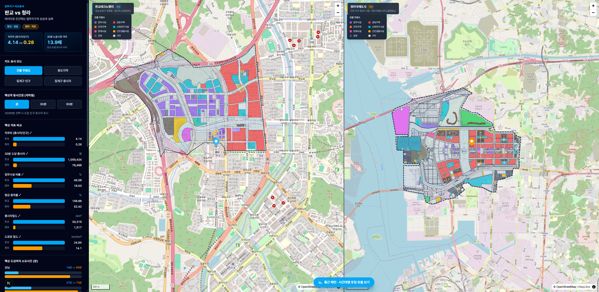
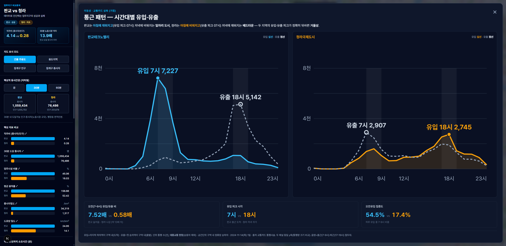

<div align="center">

# 판교 vs 청라 — 업무지구 비교분석 시스템

### Pangyo vs Cheongna — Business District Comparative Analysis

**"업무지구의 실패와 성공여부"** 를 공공데이터로 진단한다.
판교테크노밸리(성공)와 인천 청라국제도시(저조)를 **동일 기준**으로 정량 비교하여
업무지구의 성공·실패 요인을 데이터로 답하는 인터랙티브 분석 시스템.

가천대학교 학부생 **김태우** · [twdaniel@gachon.ac.kr](mailto:twdaniel@gachon.ac.kr) · *스마트시티 이론과 실제*

<br/>

[](https://twtwtiwa05.github.io/pangyo-cheongna-analysis/)

[](https://nextjs.org/)
[](https://react.dev/)
[](https://www.typescriptlang.org/)
[](https://maplibre.org/)
[](https://www.python.org/)
[](https://geopandas.org/)
[](https://duckdb.org/)
[](https://twtwtiwa05.github.io/pangyo-cheongna-analysis/)
[](LICENSE)

<br/>

<a href="https://twtwtiwa05.github.io/pangyo-cheongna-analysis/">
  
</a>

<sub>이미지를 클릭하면 <b>라이브 데모</b>가 새 창에서 열립니다 — <a href="https://twtwtiwa05.github.io/pangyo-cheongna-analysis/">twtwtiwa05.github.io/pangyo-cheongna-analysis</a></sub>

</div>

---

## 한 줄 결론

> 판교(삼평동, 직주비 **4.14**)는 신분당선으로 강남 노동시장에 **30분 직결**(도달 종사자 **106만 명**)되어 업무지구로 성공했고,
> 청라(청라1~3동, 직주비 **0.28**)는 핵심역 접근성 열위(강남 **65분**·도달 종사자 **7.6만 명**)로 업무기능이 미실현되어 주거 위주 베드타운화했다.

| 지표 (동일 기준) | 판교 | 청라 | 격차 |
| --- | ---: | ---: | :---: |
| 30분 도달 종사자 (노동시장 규모) | 1,059,434 | 76,486 | **13.9배** |
| 직주비 (종사자/상주인구) | 4.14 | 0.28 | 약 15배 |
| 업무시설 연면적 비율 | 45.1% | 16.0% | 2.8배 |
| 평균 용적률 (개발 실현도) | 156.7% | 52.4% | 3.0배 |
| 종사자밀도 (명/㎢) | 34,319 | 1,517 | 22.6배 |
| 핵심역 → 강남 (지하철) | 13.9분 | 65.3분 | 4.7배 |

세 영역(토지이용·교통접근성·인구사회)이 **하나의 결론으로 수렴**한다 — 노동시장 접근성 격차가 업무지구의 성패를 갈랐다.

## 주요 기능

- **두 지역 동시 비교 지도** — 판교·청라를 **side-by-side**로 배치, 동일 색 스케일·범례로 한눈에 대조
- **4종 시각화 모드** — 건물 주용도 · 용도지역(필지 단위) / 집계구 인구 · 종사자(Choropleth)를 즉시 전환
- **핵심역 등시간권 레이어** — 지하철 네트워크 기반 **30/60분 도달권 폴리곤** + 각 권역의 **도달 인구·종사자 수치** 표시
- **통근 패턴 모달** — 통신사 경로통행·교통카드 OD로 **시간대별 유입·유출**을 시각화(판교 아침 유입형 vs 청라 저녁 유입형)
- **실시간 통계 패널** — KPI 격차, 핵심지표 비교 막대, 핵심 도심 접근성, 수단분담, 시간대별 통행 곡선
- **필지 클릭 상세** — 지번·용도지역·주용도·연면적·용적률·건물 수·사용승인년 팝업
- **모드별 범례 + 지역 정체색** — 색의 의미를 항상 노출, 판교(파랑)/청라(주황) 일관 구분
- **V-World/OSM 베이스맵 자동 폴백** — 타일 차단 시 OpenStreetMap으로 전환
- **정적 배포** — Next.js Static Export → GitHub Actions로 GitHub Pages 자동 배포

## 화면

<table>
  <tr>
    <td width="50%" align="center">
      
      <br/><b>핵심역 30분 등시간권</b>
      <br/><sub>판교는 신분당선 축으로 강남까지 연속 도달권(106만 종사자),<br/>청라는 공항철도 따라 파편적 소규모 도달권(7.6만 종사자)</sub>
    </td>
    <td width="50%" align="center">
      
      <br/><b>통근 패턴 — 시간대별 유입·유출</b>
      <br/><sub>판교는 아침 출근 유입(7시 7,227건, 7.52배),<br/>청라는 저녁 퇴근 유입(18시 2,745건) — 베드타운 성격</sub>
    </td>
  </tr>
</table>

## 분석 설계 — 비교의 엄밀성

이 프로젝트의 핵심은 **성격이 다른 두 업무지구를 같은 잣대로 측정**하여 결론의 신뢰성을 확보하는 것이다.

### 1. 구역 정의

| 구역 | 행정구역 | 면적 | 핵심역 |
| --- | --- | ---: | --- |
| **판교** (성공) | 경기 성남시 분당구 **삼평동** | 2.84㎢ | 판교역 (신분당선) |
| **청라** (저조) | 인천 서구 **청라1·2·3동** | 20.53㎢ | 청라국제도시역 (공항철도) |

> 면적 비대칭(7.2배)은 절대량 대신 **구성비·밀도·직주비**로 정규화하여 공정 비교한다.

### 2. 공간 단위 통합 (단위 불일치 해결)

| 데이터 | 공간 단위 | 조인 키 |
| --- | --- | --- |
| 건축물대장 (건축HUB) | 건축물 (점) | PNU(19자리) |
| 토지이용계획 (V-World) | 필지 (폴리곤) | PNU |
| 인구·종사자 (SGIS) | 집계구 (폴리곤, ~500명) | 집계구 코드 |
| 지하철 네트워크 | 노드/링크 그래프 | 노드 ID |

> 건축물(점) → 필지(PNU 매칭) → 집계구(centroid 공간조인) 3단계로 통합하고,
> 대표 주용도는 **연면적 가중 최빈값**으로 산출한다. CRS는 저장·교환 `EPSG:4326`, 거리·면적 계산은 `EPSG:5179`로 재투영한다.

### 3. 등시간권 산출 방법

제공된 수도권 지하철 그래프(916 노드 / 1,193 링크)에서 **환승 대기시간이 반영된** `timeFT`/`timeTF`를 양방향 directed CSR로 펼쳐
`scipy.sparse.csgraph.dijkstra`로 최단 시간을 계산한다(30분 = 1,800초, 60분 = 3,600초).
도달 노드를 폴리곤화한 뒤 **SGIS 집계구를 행정동 면적안분**으로 결합하여 등시간권 내 도달 인구·종사자를 추정한다.

## 데이터 출처 · 기준시점 (재현성 핵심)

> 필수 지표는 **동일 기준연도**로 비교한다. 이동데이터(가점)는 기준월이 달라 **출처·기준월을 명기한 보조지표**로만 사용한다.

| 데이터 | 출처 | 기준시점 | 코드체계 / 비고 |
| --- | --- | --- | --- |
| 집계구 인구·가구·종사자·사업체 | **SGIS** 통계지리정보 [↗](https://sgis.kostat.go.kr/) | **2023** | 통계청 집계구 (분당 31023 · 서구 23080) |
| 용도지역·필지 | **V-World** 국토정보플랫폼 [↗](https://www.vworld.kr/) | **2025 고시** | `LP_PA_CBND_BUBUN` · `LT_C_UQ111` (41135 · 28260) |
| 건축물대장 (표제부) | **건축HUB** [↗](https://www.hub.go.kr/) | 현행(2026-06 수집) | `getBrTitleInfo` — 주용도·연면적·사용승인일 |
| 도로망 | **OpenStreetMap** [↗](https://www.openstreetmap.org/) | 2026-06-20 수집 | `osmnx` graph_from_polygon (ODbL) |
| 수도권 지하철 그래프 | 제공 (강의자료) | 2026-06 운영본 | 노드/링크 + 환승 대기시간 반영 |
| (가점) 통신사 경로통행 P1 | 제공 | **2025-02-11** | KTDB 통합표준노드링크 맵매칭 |
| (가점) 교통카드 OD | 제공 (전처리) | **2024-11-14** | 정류장 ID 기반 통행사슬 |

## 처리 과정 (파이프라인)

```
 ┌──────────────────────── 데이터 수집·전처리 (Python) ─────────────────────────┐
 │  SGIS ─┐                                                                      │
 │  V-World ┼─▶ fetch/  ─▶ raw 캐시 ─▶ 공간조인·집계 ─▶ 지표 산출 ─▶ GeoJSON/JSON │
 │  건축HUB ┤             (DuckDB/pyarrow 컬럼투영·술어푸시다운 — 대용량 안전)     │
 │  OSM ────┘                                                                    │
 │  지하철 그래프 ─▶ dijkstra 등시간권 ─▶ 집계구 면적안분 ─▶ 도달 인구·종사자     │
 └──────────────────────────────────────────────────────────┬───────────────────┘
                                                             │ make_manifest (산출물 통합)
                                                             ▼
 ┌────────────────────── 웹 (Next.js 16 + MapLibre GL) ───────────────────────────┐
 │  public/data/*.{geojson,json} ─▶ RegionMap ×2 (side-by-side) + Sidebar (차트)   │
 └──────────────────────────────────────────────────────────┬───────────────────┘
                                                             │ next build (static export)
                                                             ▼
                            GitHub Actions ─▶ GitHub Pages (공개 URL)
```

전처리 스크립트는 `03_analysis/scripts/`에 단계별로 분리되어 있다.

```bash
fetch_sgis.py          # SGIS 집계구 인구·종사자·사업체
make_districts.py      # 판교·청라 구역계·면적 정의
fetch_vworld.py        # VWorld 필지·용도지역
fetch_buildinghub.py   # 건축물대장(표제부)
fetch_osm.py           # OSM 도로망
step4_landuse.py       # 토지이용 지표 (용도구성·혼합도·용적률)
isochrone.py           # 등시간권 (dijkstra 30/60분 + 폴리곤)   ← 03_analysis/transport/
step5_reach.py         # 도달 인구·종사자 (집계구 면적안분)
step6_socio.py         # 인구사회 지표 (직주비·밀도·업종)
step7_smartcard.py     # (가점) 교통카드 OD
telco_day.py           # (가점) 통신사 경로통행 P1
commute_pattern.py     # 통근 패턴 (시간대별 유입·유출)
step8_validate.py      # 통계 검증 (KS·Cliff's δ)
make_manifest.py       # 웹 시스템 데이터 통합
```

## 사용 기술

| 구분 | 사용 프로그램 |
| --- | --- |
| 데이터 수집·전처리 | **Python 3.12** · `geopandas` · `shapely` · `pyproj` · `pyogrio` · `requests` |
| 대용량 처리 | **DuckDB** · `pyarrow` (컬럼투영·술어푸시다운 — 통신사 ~194GB 안전 처리) |
| 등시간권 계산 | `scipy.sparse.csgraph.dijkstra` · `numpy` · `pandas` |
| 웹 프론트엔드 | **Next.js 16** (App Router) · **React 19** · **TypeScript** · Tailwind CSS v4 |
| 지도 렌더링 | **MapLibre GL JS** · V-World WMTS / OpenStreetMap |
| 차트 | SVG/CSS 직접 렌더 (라이브러리 의존성 0 — 번들 경량·배포 안정) |
| 배포 | **GitHub Actions** → **GitHub Pages** (정적 export) |

## 디렉토리 구조

```
pangyo-cheongna-analysis/
├── .github/workflows/deploy.yml   # GitHub Pages 자동 배포
├── 01_구역선정/                    # 구역계 정의·면적·"저조" 근거 리서치
├── 02_data/
│   ├── DATA_DICTIONARY.md         # 데이터 스키마·코드값·단위 명세
│   └── processed/                 # 가공 산출물 (GeoJSON/JSON)
├── 03_analysis/
│   ├── scripts/                   # 단계별 수집·전처리 스크립트
│   ├── transport/isochrone.py     # 등시간권 (dijkstra)
│   ├── landuse/ socio/ mobility/  # 영역별 분석
│   └── validation/                # 통계 검증
├── 04_system/web/                 # Next.js + MapLibre 비교 시스템 (배포 루트)
│   ├── app/                       # App Router (page, layout)
│   ├── components/                # RegionMap · Sidebar · MapLegend · Charts · CommutePattern
│   ├── lib/categories.ts          # 색 팔레트·범례·choropleth 스케일 (단일 소스)
│   └── public/data/               # 앱이 서빙하는 GeoJSON/JSON
├── 05_report/                     # 보고서 인계용 근거맵
├── requirements.txt               # Python 패키지 버전 고정
└── README.md
```

## 로컬에서 실행하기

### 웹 앱만 실행 (데이터는 이미 포함)

```bash
git clone https://github.com/twtwtiwa05/pangyo-cheongna-analysis.git
cd pangyo-cheongna-analysis/04_system/web
npm install
npm run dev          # → http://localhost:3000
```

> V-World 키가 없으면 베이스맵이 **OpenStreetMap으로 자동 폴백**되어 그대로 동작한다.
> 위성 베이스맵을 쓰려면 `04_system/web/.env.local`에 키를 추가한다.
> ```bash
> echo "NEXT_PUBLIC_VWORLD_API_KEY=발급받은_키" > 04_system/web/.env.local
> ```

### 데이터 파이프라인부터 재현 (선택)

```bash
python -m venv .venv && source .venv/bin/activate   # Windows: .venv\Scripts\activate
pip install -r requirements.txt
# .env 에 API 키(SGIS·VWORLD·BUILDING_HUB) 설정 후
python 03_analysis/scripts/fetch_sgis.py
python 03_analysis/scripts/make_districts.py
python 03_analysis/scripts/fetch_vworld.py
python 03_analysis/scripts/fetch_buildinghub.py
python 03_analysis/scripts/fetch_osm.py
python 03_analysis/scripts/step4_landuse.py
python 03_analysis/transport/isochrone.py
python 03_analysis/scripts/step5_reach.py
python 03_analysis/scripts/step6_socio.py
python 03_analysis/scripts/make_manifest.py
```

> **재현성 원칙** — 난수 시드 고정(`random_state=42`), 패키지 버전 고정(`requirements.txt`), 원본 데이터 읽기 전용,
> 모든 산출물에 입력 경로·파라미터·기준월 기록. "한 번 실행하면 같은 결과".

## 한계 (해석상 유의)

- **상관 ≠ 인과** — 접근성과 업무 집적의 강한 동조는 보이나, 단일 요인의 인과로 단정하지 않는다.
- **면적 비대칭** — 판교·청라 면적 7.2배 차는 구성비·밀도·직주비로 정규화했으나 절대량 비교는 제한적이다.
- **기준시점 불일치** — 이동데이터(통신사 2025-02 / 교통카드 2024-11)는 필수 지표(기준연도 통일)와 분리해 보조지표로만 사용한다.
- **면적안분 가정** — 등시간권 도달 인구·종사자는 행정동 내 균등분포를 가정한 추정치이다.

## Author

**김태우 (Kim Taewoo)** — 가천대학교 학부생
[twdaniel@gachon.ac.kr](mailto:twdaniel@gachon.ac.kr) · GitHub [@twtwtiwa05](https://github.com/twtwtiwa05)

## License

이 프로젝트는 [MIT License](LICENSE) 하에 배포된다.
원본 데이터(SGIS · V-World · 건축HUB · OpenStreetMap · 제공 이동데이터)는 각 제공기관의 이용약관을 따른다.
